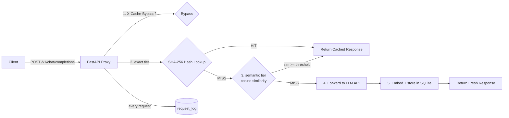

# Semantic Cache Proxy for LLM APIs

A drop-in caching proxy that sits in front of any OpenAI-compatible LLM API, recognizes when a new prompt means roughly the same thing as one it has already answered, and serves the cached response instead of paying for another generation — with live metrics proving how much it saved.

> **Resume line:** Built a semantic caching proxy for LLM APIs using embedding similarity matching, with a tuned threshold validated against a labeled test set, cutting redundant API spend with live hit-rate and cost-saved tracking.

---

## The problem

LLM applications ask the *same questions in slightly different words* all day long. Every paraphrase is billed as a fresh generation. Exact-match caching can't help ("What is the capital of France?" ≠ "Tell me the capital of France."), so the real problems are:

- **Cache key strategy** — what makes two prompts "the same question"?
- **Similarity threshold tuning** — too loose serves confidently wrong answers; too strict never hits.
- **Invalidation** — stale answers must expire.

This proxy solves all three and documents the tradeoff with measured data.

---

## Architecture



Two-tier lookup: an O(1) SHA-256 exact-hash match runs first; on a miss, the prompt is embedded with `BAAI/bge-small-en-v1.5` (384-dim, CPU) and compared against cached embeddings via cosine similarity. Hits above the configured threshold are served from cache. Every request — HIT, MISS, or BYPASS — is logged with latency, token counts, and estimated cost.

---

## Measured threshold validation

Precision/recall across thresholds against a 31-pair labeled dataset (full analysis: [`docs/THRESHOLD_ANALYSIS.md`](docs/THRESHOLD_ANALYSIS.md)):

| Threshold | Precision | Recall | F1 |
|-----------|-----------|--------|------|
| 0.80 | 0.7143 | 0.9375 | 0.8108 |
| 0.82 | 0.7500 | 0.9375 | 0.8333 |
| **0.85** | 0.7895 | 0.9375 | **0.8571** ← default, F1-optimal |
| 0.88 | 0.9231 | 0.7500 | 0.8276 |
| 0.90 | 0.9000 | 0.5625 | 0.6923 |
| 0.93 | 1.0000 | 0.3125 | 0.4762 |
| 0.95 | 1.0000 | 0.2500 | 0.4000 |

**Why 0.85:** below it, antonym pairs like *"Translate 'hello' to Spanish"* vs *"Translate 'goodbye' to Spanish"* (similarity 0.864!) become false hits; above it, genuine paraphrases like *"What is 2 + 2?"* ↔ *"Calculate two plus two."* (0.860) stop hitting. 0.85 maximizes F1 = 0.857.

---

## Tech stack

| Layer | Technology |
|-------|------------|
| Proxy server | FastAPI + Uvicorn |
| LLM forwarding | httpx (async) |
| Validation models | Pydantic v2 |
| Embeddings | sentence-transformers · `BAAI/bge-small-en-v1.5` (CPU) |
| Vector math | numpy (dot-product cosine on unit vectors) |
| Storage | SQLite (WAL mode, foreign keys ON) |
| Testing | pytest + pytest-asyncio (45 tests) |

---

## Quick start

```bash
git clone <this-repo>
cd <repo>
pip install -r requirements.txt

# 1. Try it with zero API keys (mock mode):
set MOCK_LLM=true                     # Windows (export on Linux/macOS)
uvicorn src.proxy.main:app --reload   # or: make run

# 2. Send a chat completion through the proxy:
curl -X POST http://127.0.0.1:8000/v1/chat/completions ^
     -H "Content-Type: application/json" ^
     -d "{\"model\": \"gpt-3.5-turbo\", \"messages\": [{\"role\": \"user\", \"content\": \"What is the capital of France?\"}]}"

# 3. Send it again -> cache_metadata.outcome == "HIT"

# 4. Check the savings:
curl http://127.0.0.1:8000/metrics

# Run the test suite:            make test
# Reproduce the sweep:           python scripts/run_sweep.py
```

To proxy a real LLM, set `MOCK_LLM=false` plus `LLM_API_KEY` / `LLM_API_BASE_URL`. Clients keep their existing OpenAI code and only change the base URL.

---

## API reference

### `POST /v1/chat/completions`

Mirrors the OpenAI Chat Completions shape exactly.

```bash
curl -X POST http://127.0.0.1:8000/v1/chat/completions \
     -H "Content-Type: application/json" \
     -H "X-Cache-Bypass: false" \
     -d '{"model": "gpt-3.5-turbo",
          "messages": [{"role": "user", "content": "Explain quantum computing simply"}]}'
```

Response adds one field to the standard body:

```json
{
  "id": "chatcmpl-...",
  "choices": [...],
  "usage": {...},
  "cache_metadata": { "outcome": "HIT", "similarity_score": 0.913 }
}
```

Set header `X-Cache-Bypass: true` to force a fresh generation (logged as `BYPASS`).

### `GET /metrics`

```json
{
  "hit_rate": 0.6667,
  "total_requests": 3,
  "estimated_cost_saved_usd": 0.0021,
  "avg_latency_hit_ms": 12.4,
  "avg_latency_miss_ms": 890.1
}
```

Cost estimation uses gpt-3.5-turbo pricing ($0.50/1M input, $1.50/1M output tokens).

### `POST /cache/purge`

```bash
curl -X POST http://127.0.0.1:8000/cache/purge -H "Content-Type: application/json" -d '{}'
curl -X POST http://127.0.0.1:8000/cache/purge -H "Content-Type: application/json" -d '{"entry_id": 42}'
```

Purging nulls out `request_log` foreign-key references first, preserving metrics history while deleting entries.

### `GET /health` · `POST /eval/threshold-sweep`

```bash
curl http://127.0.0.1:8000/health

curl -X POST http://127.0.0.1:8000/eval/threshold-sweep \
     -H "Content-Type: application/json" \
     -d '{"thresholds": [0.80, 0.82, 0.85, 0.88, 0.90, 0.93, 0.95]}'
# -> {"results": [{"threshold": 0.80, "precision": ..., "recall": ..., "f1": ...}, ...]}
```

The sweep embeds each labeled pair once, then classifies at every requested threshold — see [`docs/THRESHOLD_ANALYSIS.md`](docs/THRESHOLD_ANALYSIS.md).

### `GET /cache/entries?q=` · `GET /logs/recent?limit=`

Dashboard backing endpoints (also useful programmatically):

```bash
curl "http://127.0.0.1:8000/cache/entries?q=France"   # entries newest-first, substring filter
curl "http://127.0.0.1:8000/logs/recent?limit=50"     # recent request-log rows, newest-first
```

---

## Configuration

All settings are environment variables (see [.env.example](.env.example)):

| Variable | Default | Purpose |
|----------|---------|---------|
| `LLM_API_BASE_URL` | `https://api.openai.com/v1` | Upstream LLM API |
| `LLM_API_KEY` | `sk-placeholder` | API key for upstream LLM |
| `LLM_MODEL` | `gpt-3.5-turbo` | Default model name |
| `MOCK_LLM` | `false` | Mock mode — no real API calls |
| `CACHE_DB_PATH` | `cache.db` | SQLite database path |
| `CACHE_TTL_SECONDS` | `3600` | Cache entry time-to-live |
| `SIMILARITY_THRESHOLD` | `0.85` | Cosine floor for semantic hits |
| `HOST` | `127.0.0.1` | Bind address |
| `PORT` | `8000` | Bind port |

---

## Deployment (Phase 6)

**Docker (any host):**
```bash
docker build -t semantic-cache-proxy .
docker run -p 8000:8000 -e MOCK_LLM=true semantic-cache-proxy   # safe demo mode
```
Image notes: CPU-only PyTorch wheels (`--extra-index-url …/whl/cpu`) keep the image at ~2.2 GB instead of ~4+; the BGE model is **baked into the image** so cold starts don't re-download ~130 MB from the HF Hub (~14 s to healthy).

**Render (blueprint included):**
1. Push this repo to GitHub
2. Render dashboard → **New + → Blueprint** → pick the repo (reads `render.yaml`, health check `/health`)
3. Defaults to `MOCK_LLM=true` so a public demo can never spend money. To proxy a real LLM: set a **spend cap** on the API key *first*, then set `MOCK_LLM=false` + `LLM_API_KEY` (as a secret) in the dashboard

**Railway / Heroku (Procfile included):** create a service from the repo — `Procfile` starts uvicorn on `$PORT` automatically.

Caveats worth knowing:
- SQLite lives on the instance filesystem — free tiers reset cache and log history on every redeploy/restart. Attach a disk or swap in Postgres/Redis for durability.
- Free-tier RAM (512 MB) is tight for torch + BGE-small; if you see OOM kills, use a starter tier.
- At production scale, swap SQLite → Postgres/Redis (the schema is intentionally portable).

---

## Project layout

```
├── src/proxy/           FastAPI app, cache layer, embeddings, eval module, static dashboard
│   ├── main.py          App entry + /health /metrics /cache/purge /eval/threshold-sweep /dashboard
│   ├── cache.py         Two-tier lookup, store, purge, logging, metrics, dashboard queries
│   ├── eval.py          Threshold sweep: batch embed → classify → P/R/F1
│   ├── database.py      SQLite schema + 31 labeled test pairs
│   └── ...
├── tests/               51 tests (unit + integration)
├── scripts/             Sweep runner, pair checker, JSON exporter
├── data/labeled_test_pairs.json   Reproducible validation dataset
├── Dockerfile · .dockerignore · render.yaml · Procfile   Deployment artifacts
└── docs/                PRD, technical detail, master guide, threshold analysis, progress
```

## Status & roadmap

- [x] Phase 1 — proxy skeleton + exact-match cache
- [x] Phase 2 — semantic matching (BGE-small)
- [x] Phase 3 — threshold validation (`/eval/threshold-sweep` + measured curve)
- [x] Phase 4 — TTL expiry + manual purge + bypass header
- [x] Phase 5 — metrics + dashboard (`/dashboard` — FastAPI + Chart.js, single service)
- [x] Phase 6 — deployment artifacts (`Dockerfile` + `render.yaml` + `Procfile`, Docker-verified locally) · live cloud deploy: see [Deployment](#deployment-phase-6)
- [ ] Stretch — wire in front of a downstream project; report before/after costs

## Dashboard

Run the proxy and open **`http://127.0.0.1:8000/dashboard`** for live hit-rate/cost/latency charts, a searchable cache browser with purge actions, an interactive threshold-sweep runner, and a polling request log. (Chart.js loads from CDN — first view needs internet.)
