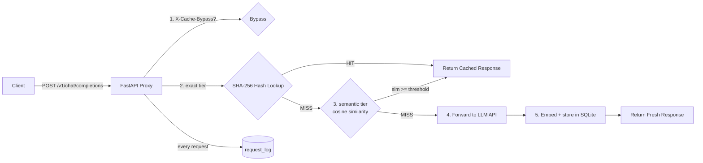

# Semantic Cache Proxy for LLM APIs

[](https://github.com/NobleChicken97/Semantic-Caching-for-LLM-cost-reduction/actions/workflows/ci.yml)

A drop-in caching proxy that sits in front of any OpenAI-compatible LLM API, recognizes when a new prompt means roughly the same thing as one it has already answered, and serves the cached response instead of paying for another generation — with live metrics proving how much it saved.

> **Resume line:** Built a semantic caching proxy for LLM APIs using embedding similarity matching, with a tuned threshold validated against a labeled test set, cutting redundant API spend with live hit-rate and cost-saved tracking.

> **What's new:** there's a session-by-session build log in [`docs/progress.md`](docs/progress.md) — every phase, decision, bug (with root cause), and measured number. Recent highlights: [`/eval/auto-tune`](#post-evalauto-tune) (re-derives the threshold pick with borderline-pair evidence), a per-upstream circuit breaker (fail-fast 503s when an upstream is sick), tiktoken-accurate token accounting, and a re-validated 0.85 threshold (F1 0.8571 on the labeled set).

---

## The problem

LLM applications ask the *same questions in slightly different words* all day long. Every paraphrase is billed as a fresh generation. Exact-match caching can't help ("What is the capital of France?" ≠ "Tell me the capital of France."), so the real problems are:

- **Cache key strategy** — what makes two prompts "the same question"?
- **Similarity threshold tuning** — too loose serves confidently wrong answers; too strict never hits.
- **Invalidation** — stale answers must expire.

This proxy solves all three and documents the tradeoff with measured data.

---

## Architecture



Two-tier lookup: an O(1) SHA-256 exact-hash match runs first; on a miss, the prompt is embedded with `BAAI/bge-small-en-v1.5` (384-dim, CPU) and compared against cached embeddings via cosine similarity. Hits above the configured threshold are served from cache. Every request — HIT, MISS, or BYPASS — is logged with latency, token counts, and estimated cost.

---

## Measured threshold validation

Precision/recall across thresholds against a 31-pair labeled dataset (full analysis: [`docs/THRESHOLD_ANALYSIS.md`](docs/THRESHOLD_ANALYSIS.md)):

| Threshold | Precision | Recall | F1 |
|-----------|-----------|--------|------|
| 0.80 | 0.7143 | 0.9375 | 0.8108 |
| 0.82 | 0.7500 | 0.9375 | 0.8333 |
| **0.85** | 0.7895 | 0.9375 | **0.8571** ← default, F1-optimal |
| 0.88 | 0.9231 | 0.7500 | 0.8276 |
| 0.90 | 0.9000 | 0.5625 | 0.6923 |
| 0.93 | 1.0000 | 0.3125 | 0.4762 |
| 0.95 | 1.0000 | 0.2500 | 0.4000 |

**Why 0.85:** below it, antonym pairs like *"Translate 'hello' to Spanish"* vs *"Translate 'goodbye' to Spanish"* (similarity 0.864!) become false hits; above it, genuine paraphrases like *"What is 2 + 2?"* ↔ *"Calculate two plus two."* (0.860) stop hitting. 0.85 maximizes F1 = 0.857.

> **Methodology caveat:** these numbers come from direct pairwise comparison of the labeled pairs. Production lookup scans all cached entries and takes the global max similarity — which can only make effective precision better or equal at the same threshold floor. Pairwise F1 is a conservative lower bound, not a live-traffic measurement (full note: [`docs/THRESHOLD_ANALYSIS.md`](docs/THRESHOLD_ANALYSIS.md#methodology)).

---

## Tech stack

| Layer | Technology |
|-------|------------|
| Proxy server | FastAPI + Uvicorn |
| LLM forwarding | httpx (async) |
| Validation models | Pydantic v2 |
| Embeddings | sentence-transformers · `BAAI/bge-small-en-v1.5` (CPU) |
| Vector math | numpy (dot-product cosine on unit vectors) |
| Storage | SQLite (WAL mode, foreign keys ON) |
| Testing | pytest + pytest-asyncio (172 tests) |

---

## Quick start

```bash
git clone <this-repo>
cd <repo>
pip install -r requirements.txt -r requirements-dev.txt

# 1. Try it with zero API keys (mock mode):
set MOCK_LLM=true                     # Windows (export on Linux/macOS)
uvicorn src.proxy.main:app --reload   # or: make run

# 2. Send a chat completion through the proxy:
curl -X POST http://127.0.0.1:8000/v1/chat/completions ^
     -H "Content-Type: application/json" ^
     -d "{\"model\": \"gpt-3.5-turbo\", \"messages\": [{\"role\": \"user\", \"content\": \"What is the capital of France?\"}]}"

# 3. Send it again -> cache_metadata.outcome == "HIT"

# 4. Check the savings:
curl http://127.0.0.1:8000/metrics

# Run the test suite:            make test          (or: python -m pytest tests/ -q)
# Reproduce the sweep:           python scripts/run_sweep.py
```

> **Windows notes:** `make` isn't available — run the underlying commands directly
> (`python -m uvicorn src.proxy.main:app --reload`, `python -m pytest tests/ -q`).
> And on PowerShell 5.x, don't send JSON through `curl.exe` (PS strips inner quotes
> → 422). Use `Invoke-RestMethod` — a ready-made `Ask` helper lives in
> [`docs/LAUNCH_CHECKLIST.md`](docs/LAUNCH_CHECKLIST.md).

To proxy a real LLM, set `MOCK_LLM=false` plus `LLM_API_KEY` / `LLM_API_BASE_URL`. Clients keep their existing OpenAI code and only change the base URL.

---

## API reference

### `POST /v1/chat/completions`

Mirrors the OpenAI Chat Completions shape exactly.

```bash
curl -X POST http://127.0.0.1:8000/v1/chat/completions \
     -H "Content-Type: application/json" \
     -H "X-Cache-Bypass: false" \
     -d '{"model": "gpt-3.5-turbo",
          "messages": [{"role": "user", "content": "Explain quantum computing simply"}]}'
```

Response adds one field to the standard body:

```json
{
  "id": "chatcmpl-...",
  "choices": [...],
  "usage": {...},
  "cache_metadata": { "outcome": "HIT", "similarity_score": 0.913 }
}
```

Set header `X-Cache-Bypass: true` to force a fresh generation (logged as `BYPASS`).

### `GET /metrics`

```json
{
  "hit_rate": 0.6667,
  "total_requests": 3,
  "estimated_cost_saved_usd": 0.0021,
  "avg_latency_hit_ms": 12.4,
  "avg_latency_miss_ms": 890.1
}
```

Cost estimation uses gpt-3.5-turbo pricing ($0.50/1M input, $1.50/1M output tokens).

### `POST /cache/purge`

```bash
curl -X POST http://127.0.0.1:8000/cache/purge -H "Content-Type: application/json" -d '{}'
curl -X POST http://127.0.0.1:8000/cache/purge -H "Content-Type: application/json" -d '{"entry_id": 42}'
```

Purging nulls out `request_log` foreign-key references first, preserving metrics history while deleting entries.

> **Auth:** `/cache/purge`, `/eval/threshold-sweep` and `/dashboard` are admin endpoints — when `ADMIN_TOKEN` is set they require `Authorization: Bearer <ADMIN_TOKEN>` (else `401`); unset (default) they're open, which keeps local mock-mode demos frictionless. Browsers can't send that header on a link, so `?token=<ADMIN_TOKEN>` is also accepted as a fallback (header wins) — e.g. open `/dashboard?token=<ADMIN_TOKEN>`; the dashboard attaches it to its own purge/sweep calls. See [Configuration](#configuration).

### `GET /`

A small service card for anyone typing the bare URL — service name, version, and the endpoint map (no data, no auth).

### `GET /health` · `POST /eval/threshold-sweep`

```bash
curl http://127.0.0.1:8000/health

curl -X POST http://127.0.0.1:8000/eval/threshold-sweep \
     -H "Content-Type: application/json" \
     -d '{"thresholds": [0.80, 0.82, 0.85, 0.88, 0.90, 0.93, 0.95]}'
# -> {"results": [{"threshold": 0.80, "precision": ..., "recall": ..., "f1": ...}, ...]}
```

The sweep embeds each labeled pair once, then classifies at every requested threshold — see [`docs/THRESHOLD_ANALYSIS.md`](docs/THRESHOLD_ANALYSIS.md).

#### `POST /eval/auto-tune`

Developer aid on top of the sweep: picks the F1-optimal threshold and surfaces the borderline labeled pairs that justify the pick.

```bash
curl -X POST http://127.0.0.1:8000/eval/auto-tune -H "Content-Type: application/json" -d '{}'
# -> {"best_threshold": 0.85, "best_f1": 0.8571,
#     "results": [ ...same shape as /eval/threshold-sweep... ],
#     "borderline": [{"prompt_a": "...", "prompt_b": "...", "similarity": 0.861, "should_match": true}, ...]}
```

- Omit the body (or `"thresholds": null`) to sweep the documented default grid `[0.80 … 0.95]`; pass an explicit list to search your own.
- F1 ties break toward the **lower** threshold — at equal F1, extra recall is worth more than extra precision for a cache (a false hit serves a slightly-off answer; a false miss just pays for one more generation).
- `borderline` lists pairs within ±0.03 of the pick, nearest first (max 10) — concrete evidence for why the threshold sits where it does.

### `GET /cache/entries?q=` · `GET /logs/recent?limit=`

Dashboard backing endpoints (also useful programmatically):

```bash
curl "http://127.0.0.1:8000/cache/entries?q=France"   # entries newest-first, substring filter
curl "http://127.0.0.1:8000/logs/recent?limit=50"     # recent request-log rows, newest-first
```

---

## Configuration

All settings are environment variables (see [.env.example](.env.example)):

| Variable | Default | Purpose |
|----------|---------|---------|
| `LLM_API_BASE_URL` | `https://api.openai.com/v1` | Upstream LLM API |
| `LLM_API_KEY` | `sk-placeholder` | API key for upstream LLM |
| `MOCK_LLM` | `false` | Mock mode — no real API calls |
| `CACHE_DB_PATH` | `cache.db` | SQLite database path |
| `CACHE_TTL_SECONDS` | `3600` | Cache entry time-to-live |
| `SIMILARITY_THRESHOLD` | `0.85` | Cosine floor for semantic hits |
| `ADMIN_TOKEN` | *(empty)* | Bearer token guarding `/cache/purge`, `/eval/threshold-sweep`, `/dashboard`. Empty = unauthenticated (demo mode only) — **set this in any real deployment** |
| `USER_ID_PEPPER` | *(empty)* | HMAC key for deriving user_ids from caller keys. **Required before BYOK traffic**; generate once, never rotate (rotating orphans all users' cache history) |
| `MODEL_PRICING` | *(empty)* | Pricing overrides/additions, USD per 1M in/out tokens — `name=in,out;...`. Unknown models estimate at $0.00 |
| `MAX_SEMANTIC_SCAN_ENTRIES` | `5000` | Warn once per process when the semantic scan exceeds this many entries (see Known limitations) |
| `LLM_RETRY_MAX_ATTEMPTS` | `3` | Total upstream attempts incl. the first; transient failures (408/429/5xx, connection errors) are retried with backoff. `1` disables retries |
| `LLM_RETRY_BACKOFF_SECONDS` | `0.5` | Base for exponential retry backoff (capped at 8s); a provider `Retry-After` header wins over computed backoff |
| `LLM_BREAKER_FAILURE_THRESHOLD` | `5` | Per-upstream circuit breaker: after this many **consecutive** exhausted-failure forwards (transport errors, 408/429, 5xx) to the same base URL, requests fail fast with an OpenAI-shaped 503 until the cooldown elapses. Any success closes it again; `0` disables |
| `LLM_BREAKER_RESET_SECONDS` | `30` | Fail-fast cooldown; after it elapses exactly one HALF_OPEN probe request goes upstream — success closes the breaker, failure restarts the cooldown |
| `HOST` | `127.0.0.1` | Bind address |
| `PORT` | `8000` | Bind port |

> **Note:** error responses from upstream LLM failures are returned in OpenAI's shape —
> `{"error": {"message", "type", "code"}}` with the upstream status passed through
> (`502` for connection failures, `503` `upstream_circuit_open` while the circuit
> breaker is OPEN). Failed calls are logged with outcome `"ERROR"`
> and zeroed cost/token counts, and never enter the cache.

---

## Bring your own key (BYOK, Phase 7)

Multiple people can point their own free-tier keys through one proxy without
anyone spending anyone else's money or seeing anyone else's cached answers.

**How callers authenticate** — send your provider key on every request:

```bash
curl -X POST https://your-proxy/v1/chat/completions \
     -H "Authorization: Bearer $OPENROUTER_API_KEY" \
     -H "Content-Type: application/json" \
     -d '{"model": "meta-llama/llama-3.2-3b-instruct:free",
          "provider": "openrouter",
          "messages": [{"role": "user", "content": "What is the capital of France?"}]}'
```

- **Provider selection:** pass `provider` (`"openrouter"` or `"gemini"`) *or* an exact allowlisted base URL via the `X-LLM-Base-URL` header (header wins). Anything not on the allowlist is rejected with a 400 before any network call — the proxy is never an open relay.
- **Isolation:** your key is HMAC-hashed (server-side pepper) into a stable `user_id`; both cache tiers and all metrics filter on it. Two users asking the same question get **separate cache entries** — verified by tests.
- **Keyless requests** are served only while `MOCK_LLM=true` (local/CI demo mode). With `MOCK_LLM=false`, a missing key returns **401** — the server never substitutes its own key.
- **Rotating your key starts your cache history fresh** (new key → new derived user_id). Expected behavior, not a bug.
- **Metrics:** `/metrics` and the dashboard lead with **total tokens saved** (hits only) plus a per-user breakdown; cost stays as a secondary, model-aware estimate that reports `$0.00` for unrecognized/free models.

### Pre-launch verification runbook (real providers)

1. Set `MOCK_LLM=false`, a generated `USER_ID_PEPPER`, and `ADMIN_TOKEN` in the environment.
2. Have two testers use different providers (one OpenRouter free model, one Gemini flash via its OpenAI-compatible endpoint).
3. Both send the same prompt → confirm each gets `MISS` then `HIT` against **their own** entry (`/cache/entries` shows two rows, distinct `user_id`s).
4. One tester sends an expired/invalid key → clean upstream-shaped 401 from the provider; other users' traffic unaffected.
5. Send a request with `X-LLM-Base-URL: https://attacker.example` → expect 400.
6. Watch `/dashboard`: per-user token savings tick up independently.

---

## Deployment (Phase 6+)

**Production — Lightsail + custom domain (live):** [`https://semcache.noblechicken.me`](https://semcache.noblechicken.me) — Small 2GB instance ($12/mo flat), persistent SSD for SQLite (survives restarts/redeploys — the Render-free failure mode), Caddy auto-HTTPS, image shipped CI → ECR → host pull on every green `main` push. `MOCK_LLM=true`, so the demo spends $0 while exercising the full cache path (hash → embed → threshold → TTL → metrics).

**Docker (any host):**
```bash
docker build -t semantic-cache-proxy .
docker run -p 8000:8000 -e MOCK_LLM=true semantic-cache-proxy   # safe demo mode
```
Image notes: a **pinned CPU-only PyTorch build** (`torch==2.5.1+cpu`, installed from the PyTorch CPU index *before* `requirements.txt` so pip can't resolve a CUDA build) keeps the image at **2.11 GB measured** (`docker images`, 2026-08-23, python:3.11-slim base) instead of ~4+ GB; in-container check: `torch.cuda.is_available()` is False. The BGE model is **baked into the image** so cold starts don't re-download ~130 MB from the HF Hub (~14 s to healthy).

**Render (blueprint included):**
1. Push this repo to GitHub
2. Render dashboard → **New + → Blueprint** → pick the repo (reads `render.yaml`, health check `/health`)
3. Defaults to `MOCK_LLM=true` so a public demo can never spend money. To proxy a real LLM: set a **spend cap** on the API key *first*, then set `MOCK_LLM=false` + `LLM_API_KEY` (as a secret) in the dashboard

**Railway / Heroku (Procfile included):** create a service from the repo — `Procfile` starts uvicorn on `$PORT` automatically.

Caveats worth knowing:
- SQLite lives on the instance filesystem — free tiers reset cache and log history on every redeploy/restart. Attach a disk or swap in Postgres/Redis for durability.
- Free-tier RAM (512 MB) is tight for torch + BGE-small; if you see OOM kills, use a starter tier.
- At production scale, swap SQLite → Postgres/Redis (the schema is intentionally portable).

---

## Continuous integration

[`.github/workflows/ci.yml`](.github/workflows/ci.yml) runs four jobs on every push/PR:

| Job | What it proves |
|-----|----------------|
| **Lint** | `ruff` clean across `src/`, `tests/`, `scripts/` |
| **Tests** (py3.10 / 3.11 / 3.12 + Windows 3.11) | The 172-test white-box suite (cache semantics, TTL, model isolation, coalescing, error contract, auth, settings factory), a coverage report artifact, **plus a black-box smoke suite driven over HTTP against a live uvicorn server** — the same contract an OpenAI SDK client sees: MISS→HIT, paraphrase hits, cross-model key isolation, bypass, metrics accounting, logs, purge |
| **Docker smoke** | Builds the production image with GHA layer caching, asserts `torch.cuda.is_available()` is False inside it, then runs the same black-box smoke suite against the containerized server |
| **Security audit** (non-blocking) | `pip-audit` over `requirements.txt` on every push/PR; findings are published as persistent code-scanning alerts in the **Security tab** (nothing is suppressed or ignored), while transitive-CVE noise from the torch/fastapi ecosystem doesn't gate routine PRs. Dependabot version-bump PRs for pip are off (the `>=` floors make them cosmetic); CVE-driven Dependabot security PRs remain active independently |
| **Live monitor** (hourly) | Probes the **production** Lightsail service and asserts this app's own contracts: `/health` phase 7, `/` service card, `/metrics` shape. Catches a broken deploy or silently-unhealthy service within the hour; makes no provider calls (zero quota spend). No write-path probe by design — the 401 BYOK contract is covered by white-box tests, and the prod keyless path is MOCK mode (200, not 401) |

Design notes: `MOCK_LLM=true` workflow-wide means CI can never spend money; the BGE-small model (~90 MB) is cached per-OS between runs; CPU-only torch is installed *before* project deps so Linux runners never pull multi-GB CUDA wheels (same pin as the Dockerfile). Dependabot keeps actions and pip deps fresh weekly.

---

## Project layout

```
├── src/proxy/           FastAPI app, cache layer, embeddings, eval module, static dashboard
│   ├── main.py          App entry + /health /metrics /cache/purge /eval/threshold-sweep /dashboard
│   ├── cache.py         Two-tier lookup, store, purge, logging, metrics, dashboard queries
│   ├── eval.py          Threshold sweep: batch embed → classify → P/R/F1
│   ├── database.py      SQLite schema + 31 labeled test pairs
│   └── ...
├── tests/               172 tests (unit + integration)
├── scripts/             Sweep runner, JSON exporter, CI smoke suite, host provision/deploy/verify scripts, adversarial PowerShell battery (`Test-SemCache.ps1`)
│   ├── .github/         CI workflow (lint / test matrix / docker smoke / audit) + Dependabot
├── data/labeled_test_pairs.json   Reproducible validation dataset
├── Dockerfile · .dockerignore · render.yaml · Procfile   Deployment artifacts
├── docker-compose.yml · Caddyfile   Lightsail production stack (app + auto-HTTPS reverse proxy)
└── .github/workflows/deploy.yml   CD: CI-green → ECR → Lightsail pull + restart
└── docs/                PRD, technical detail, master guide, threshold analysis, progress
```

## Status & roadmap

- [x] Phase 1 — proxy skeleton + exact-match cache
- [x] Phase 2 — semantic matching (BGE-small)
- [x] Phase 3 — threshold validation (`/eval/threshold-sweep` + measured curve)
- [x] Phase 4 — TTL expiry + manual purge + bypass header
- [x] Phase 5 — metrics + dashboard (`/dashboard` — FastAPI + hand-drawn SVG viz, single service; no chart library)
- [x] Phase 6 — deployment artifacts (`Dockerfile` + `render.yaml` + `Procfile`, Docker-verified locally) · production: `https://semcache.noblechicken.me` (Lightsail Small 2GB, persistent SQLite, Caddy auto-HTTPS, ECR auto-deploy) — see [Deployment](#deployment-phase-6)
- [x] Phase 7 — BYOK multi-user: provider allowlist (openrouter/gemini), HMAC-derived user isolation, per-user cache scoping, tokens-saved headline metric, 30-day log retention with permanent rollup
- [x] Phase 9 — semantic-trust fixes: message-only embeddings (eval/prod skew closed), two-signal entity/fact veto, purge audit trail; live re-measured R=0.9375/P=0.82, spotlight all-MISS, 168 tests green
- [ ] Stretch — wire in front of a downstream project; report before/after costs

## Dashboard

Run the proxy and open **`http://127.0.0.1:8000/dashboard`** for the bento Overview (hit-rate statement, speedup gauge, live alert strip, savings ledger, request-mix trend), a searchable cache browser with TTL bars and purge actions, a Threshold Lab (sweep runner + auto-tune evidence), and a polling request log. Charts are hand-drawn SVG (no chart library); Inter/Archivo/anime.js load from CDN — first view needs internet.

When `ADMIN_TOKEN` is set, open **`/dashboard?token=<ADMIN_TOKEN>`** — the page picks the token up from the URL and authenticates its own purge/sweep calls automatically. Production instance: `https://semcache.noblechicken.me/dashboard?token=<ADMIN_TOKEN>`.

## Troubleshooting

**"Semantic scan exceeded MAX_SEMANTIC_SCAN_ENTRIES" in the logs.** The semantic tier compares the incoming prompt against *every unexpired cache entry for that user* — an O(n) scan per request, a deliberate v1 tradeoff (see `docs/design.md` §5). Once a user's live entries cross the `MAX_SEMANTIC_SCAN_ENTRIES` limit (default 5000), the proxy logs this warning once per process. It is not an error — lookups keep working — but per-request semantic latency grows linearly with entry count, so treat the warning as your cue to either shrink the scan (shorter `CACHE_TTL_SECONDS`, `POST /cache/purge`) or plan the ANN-index swap: the numpy loop inside `_semantic_lookup` was written so its body can be replaced by sqlite-vec / FAISS / pgvector without touching the function signature or any caller.
