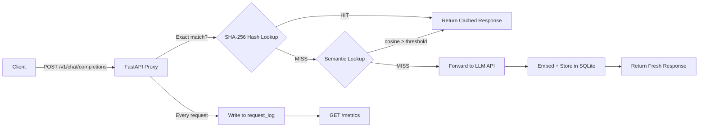

# 📝 Project Report — Semantic Caching Layer for LLM Cost Reduction

> ⚠️ **ARCHIVED SNAPSHOT (2026-08-21).** This document is a point-in-time
> analysis and is **superseded by [`progress.md`](progress.md)**, which tracks
> the project through Phase 7 (BYOK, 100+ tests) and is kept up to date.
> Claims below — test counts, folder layout, completion %, "not yet
> implemented" notes — reflect the repo as of 2026-08-21 and are known stale.

> **Date:** 2026-08-21  
> **Author:** Auto-generated from codebase analysis  
> **Project status:** In Progress (~45–50% of v1 complete)

---

## 1. Executive Summary

This project implements a **semantic caching proxy** for LLM APIs that reduces cost and latency by intercepting repeated or semantically similar prompts and serving cached responses instead of making fresh API calls. The proxy mirrors the OpenAI `/v1/chat/completions` API shape so clients only need to change their base URL.

### Current State *(updated 2026-08-21)*
- **Repo restructure (Phase 0):** ✅ Done — `src/` layout, root `.gitignore`/`pyproject.toml`/`Makefile`, docs renamed. *Changes staged in git index but NOT committed per user instruction*
- **Phase 1 (Proxy skeleton + exact-match cache):** ✅ Complete and committed (`0157904`)
- **Phase 2 (Semantic matching with BGE embeddings):** ✅ Complete (uncommitted working tree)
- **Phase 3 (Threshold validation):** ✅ Complete — `/eval/threshold-sweep` live in `src/proxy/eval.py`; 31 labeled pairs; curve measured across 7 thresholds; default 0.85 confirmed F1-optimal (see `docs/THRESHOLD_ANALYSIS.md`)
- **Phase 4 (Invalidation + bypass):** ✅ Complete — TTL expiry tests added
- **Phase 5 (Metrics + dashboard):** ✅ Complete — single-service dashboard at `/dashboard` (FastAPI + Chart.js, no new deps): metrics cards + charts, cache browser with purge actions, threshold-sweep runner, live request log. Backed by two new endpoints (`GET /cache/entries`, `GET /logs/recent`), app v0.4.0
- **Phase 6 (Deploy + integrate):** 🔧 Artifacts done & locally verified — `Dockerfile` (CPU torch pinned `torch==2.5.1+cpu`, baked model, measured **2.11 GB** on 2026-08-23) + `.dockerignore` + `render.yaml` + `Procfile`. Docker build/run tested: ~14 s to healthy, MISS→HIT + dashboard OK in-container. Live cloud deploy awaits user account; defaults to `MOCK_LLM=true` for zero-spend demos
- **README:** ✅ Populated (problem → architecture → P/R table → quick start → API reference → config → deployment guide)

---

## 2. Architecture

```
Client
  → POST /v1/chat/completions (OpenAI-shaped)
  → Proxy (FastAPI + Uvicorn):
       1. Check X-Cache-Bypass header → if "true", skip to step 5
       2. Exact-match lookup (SHA-256 hash of canonical prompt)
       3. If exact hit → return cached response (log as HIT, score=1.0)
       4. Semantic lookup (BGE-small embedding + cosine similarity)
          If similarity ≥ threshold → return cached response (log as HIT)
       5. Forward request to real LLM API (or mock)
       6. Embed prompt, store (prompt, embedding, response, TTL) in SQLite
       7. Return fresh response (log as MISS)

  → GET /metrics — aggregated hit rate, cost saved, latency
  → POST /cache/purge — manual cache invalidation
  → POST /eval/threshold-sweep — [NOT YET IMPLEMENTED]
```

### Data Flow Diagram



---

## 3. Tech Stack

| Layer | Technology | Version | Purpose |
|-------|-----------|---------|---------|
| Web framework | FastAPI | ≥0.115.0 | Async proxy server mirroring OpenAI API shape |
| ASGI server | Uvicorn | ≥0.30.0 | Production-grade ASGI server |
| HTTP client | httpx | ≥0.27.0 | Async forwarding to upstream LLM API |
| Data validation | Pydantic | ≥2.0.0 | Request/response models |
| Embeddings | sentence-transformers | ≥3.0.0 | BGE-small-en-v1.5 model on CPU |
| Vector math | numpy | ≥1.24.0 | Cosine similarity, embedding serialization |
| Cache storage | SQLite | Built-in | WAL mode, foreign keys enabled |
| Testing | pytest + pytest-asyncio | — | 24 tests across 3 test files |

---

## 4. Codebase Structure

```
project3_semantic_cache/
├── .env.example                    # All configurable env vars with docs
├── cache.db                        # SQLite database (runtime)
├── pyproject.toml                  # pytest config (asyncio_mode = "auto")
├── requirements.txt                # Python dependencies
├── proxy/
│   ├── __init__.py                 # Package marker
│   ├── main.py          (89 LOC)   # FastAPI app, lifespan, health/metrics/purge endpoints
│   ├── config.py        (35 LOC)   # Settings dataclass from env vars
│   ├── models.py       (116 LOC)   # Pydantic models (request, response, metrics, sweep)
│   ├── cache.py        (333 LOC)   # Core caching: lookup, store, purge, log, metrics
│   ├── database.py     (111 LOC)   # SQLite schema, init, seed test pairs
│   ├── embedding.py     (60 LOC)   # BGE-small wrapper, cosine similarity
│   ├── llm_client.py    (82 LOC)   # Forward to LLM or return mock response
│   └── routes/
│       ├── __init__.py
│       └── chat.py     (104 LOC)   # POST /v1/chat/completions handler
└── tests/
    ├── conftest.py                 # Shared fixtures (MOCK_LLM=true)
    ├── test_api.py     (144 LOC)   # 6 integration tests via httpx ASGI transport
    ├── test_cache.py   (167 LOC)   # 11 unit tests for cache layer
    └── test_embedding.py (52 LOC)  # 7 unit tests for embedding module

Total: ~1,293 LOC (source) + ~363 LOC (tests) = ~1,656 LOC
```

---

## 5. Phase-by-Phase Detailed Analysis

### 5.1 Phase 1 — Proxy Skeleton + Exact-Match Cache

**Goal:** Stand up a working proxy that caches exact duplicate prompts.

**What was built:**
- FastAPI application at [`main.py`](file:///c:/Users/arpan.ARPAN/OneDrive/Desktop/projects/Semantic%20caching%20layer%20for%20LLM%20cost%20reduction/src/proxy/main.py) with a `lifespan` context manager for DB initialization
- Full OpenAI-compatible request/response models in [`models.py`](file:///c:/Users/arpan.ARPAN/OneDrive/Desktop/projects/Semantic%20caching%20layer%20for%20LLM%20cost%20reduction/src/proxy/models.py) — includes `model`, `messages`, `temperature`, `max_tokens`, `top_p`, `n`, `stream`, `stop`, `presence_penalty`, `frequency_penalty`, `user`
- `canonical_prompt()` method on `ChatCompletionRequest` that concatenates `[role]content` pairs for stable hashing (ignores model params like temperature)
- SHA-256 hash-based exact cache in [`cache.py`](file:///c:/Users/arpan.ARPAN/OneDrive/Desktop/projects/Semantic%20caching%20layer%20for%20LLM%20cost%20reduction/src/proxy/cache.py) — `_hash_prompt()` + `_exact_lookup()`
- SQLite database with WAL journaling and foreign keys in [`database.py`](file:///c:/Users/arpan.ARPAN/OneDrive/Desktop/projects/Semantic%20caching%20layer%20for%20LLM%20cost%20reduction/src/proxy/database.py)
- Dual-mode LLM client in [`llm_client.py`](file:///c:/Users/arpan.ARPAN/OneDrive/Desktop/projects/Semantic%20caching%20layer%20for%20LLM%20cost%20reduction/src/proxy/llm_client.py): real httpx calls or mock responses that echo the user's message

**Key design decisions:**
1. **SHA-256 for exact match** — fast, collision-resistant, indexable. The `prompt_hash` column has a UNIQUE constraint + index
2. **Separate `canonical_prompt()`** — only message roles and content matter for caching; model params like temperature don't affect the cache key
3. **`cache_metadata` field** in response — every response includes `{outcome: "HIT"/"MISS"/"BYPASS", similarity_score}` so clients know what happened
4. **Mock LLM mode** — enables full end-to-end testing without an API key

**Git evidence:** Committed as `0157904` with the message "phase 1: proxy skeleton + exact match cache (passing e2e tests)"

---

### 5.2 Phase 2 — Semantic Matching

**Goal:** Upgrade from exact-string-match to embedding-based similarity search.

**What was built:**
- [`embedding.py`](file:///c:/Users/arpan.ARPAN/OneDrive/Desktop/projects/Semantic%20caching%20layer%20for%20LLM%20cost%20reduction/src/proxy/embedding.py): Lazy-loaded singleton of `BAAI/bge-small-en-v1.5` (384-dim, CPU-only). Embeddings are L2-normalized so cosine similarity reduces to a simple dot product
- `_semantic_lookup()` in [`cache.py`](file:///c:/Users/arpan.ARPAN/OneDrive/Desktop/projects/Semantic%20caching%20layer%20for%20LLM%20cost%20reduction/src/proxy/cache.py): fetches all non-expired entries with embeddings, computes cosine similarity against the query embedding, returns the best match if ≥ threshold
- `store()` now generates an embedding for every cached prompt
- Two-tier `lookup()`: exact hash first (fast, O(1)), then semantic fallback (O(N) scan)
- Model warmup during FastAPI startup to avoid cold-start latency on the first request

**Key design decisions:**
1. **Two-tier architecture** — exact hash match is tried first (essentially free) before falling back to the O(N) semantic scan. This means truly identical prompts are served in microseconds
2. **In-memory scan, not a vector DB** — at demo scale (~hundreds to low thousands of entries), a numpy dot product over all entries is fast enough. The master guide explicitly says "don't reach for a vector DB yet"
3. **Binary BLOB storage** — embeddings are stored as raw `float32` bytes in SQLite rather than as JSON arrays. This is 4x more compact and deserialization is a single `np.frombuffer()` call
4. **Lazy model loading** — the SentenceTransformer model is loaded on first use, not at import time. This keeps test imports fast and avoids loading the model when it's not needed

**Performance note:** The O(N) scan in `_semantic_lookup()` loads all entries into memory per request. At demo scale this is fine, but for production you'd want an approximate nearest neighbor index (Qdrant, Chroma, FAISS, etc.)

**Git status:** All changes are in the working tree but NOT committed. This should be committed.

---

### 5.3 Phase 3 — Threshold Validation ✅ COMPLETE

**Built on 2026-08-21:**
- **31 labeled test pairs** in `seed_test_pairs()` (16 should-match / 15 should-not) incl. edge cases: very short prompts ("Hi" vs "Goodbye"), a typo pair ("captial"), and code snippets (add-vs-multiply hard negative at similarity 0.845). Every label was empirically checked against real BGE similarities before being committed to seed data.
- [`src/proxy/eval.py`](file:///c:/Users/arpan.ARPAN/OneDrive/Desktop/projects/Semantic%20caching%20layer%20for%20LLM%20cost%20reduction/src/proxy/eval.py) — sweep implementation that batch-embeds every unique prompt once and classifies each threshold from precomputed similarities (identical results to naive per-threshold embedding at ~7× less compute).
- `POST /eval/threshold-sweep` registered in `main.py` (app bumped to v0.3.0).
- Sweep executed across `[0.80, 0.82, 0.85, 0.88, 0.90, 0.93, 0.95]` — **F1 peaks at the existing default 0.85 (F1=0.857)**. Full curve, borderline-pair tables, and determinism notes: [`docs/THRESHOLD_ANALYSIS.md`](THRESHOLD_ANALYSIS.md). Dataset exported to [`data/labeled_test_pairs.json`](../data/labeled_test_pairs.json).

**The master guide's "single most interview-worthy artifact" now exists with measured data.**

---

### 5.4 Phase 4 — Invalidation + Bypass (Mostly Complete)

**What works:**
- **TTL expiry:** Every stored entry gets `expires_at = now + CACHE_TTL_SECONDS`. Both lookup paths check this — `_exact_lookup()` deletes expired entries on access, `_semantic_lookup()` filters them in the SQL WHERE clause
- **Manual purge:** `POST /cache/purge` with optional `entry_id`. The `_detach_log_references()` helper (recently refactored by the user) safely nullifies foreign key references in `request_log` before deleting cache entries, preserving request history
- **Bypass header:** `X-Cache-Bypass: true` header in the request skips the cache entirely, forwards directly to the LLM, and logs the request as "BYPASS"

**Recent user change (2026-08-21):** Refactored `_detach_log_references()` into a standalone helper function used by both `_delete_entry()` and `purge()`. This eliminates code duplication and ensures consistent FK handling across all deletion paths.

**What's missing:**
- A test that explicitly validates TTL expiry behavior (entry becomes unreachable after TTL elapses)

---

### 5.5 Phase 5 — Metrics + Dashboard (Backend Only)

**What works (backend):**
- `request_log` table captures every request with: timestamp, prompt text/hash, outcome, matched entry ID, similarity score, latency, estimated cost, token counts
- `GET /metrics` aggregates: hit rate, total requests, estimated cost saved (sum of `estimated_cost_usd` for HITs), average latency for hits vs misses
- Cost estimation uses gpt-3.5-turbo pricing: $0.50/1M input tokens, $1.50/1M output tokens

**What's missing (dashboard):**
The master guide specifies four UI pages:
1. **Metrics Dashboard** — hit rate gauge, request counter, cumulative cost saved, latency comparison chart
2. **Cache Browser** — searchable/sortable table of cache entries with per-row purge
3. **Threshold Sweep** — button to run sweep, precision/recall chart
4. **Live Request Log** — recent requests with outcome, score, latency, cost

None of these exist yet. A technology choice (Streamlit vs FastAPI + Chart.js) hasn't been made.

---

### 5.6 Phase 6 — Deploy + Integrate (Not Started)

No deployment configuration, Dockerfile, or cloud platform setup exists.

---

## 6. Database Schema

### `cache_entries`
| Column | Type | Constraints | Purpose |
|--------|------|------------|---------|
| `entry_id` | INTEGER | PK AUTOINCREMENT | Unique entry identifier |
| `prompt_text` | TEXT | NOT NULL | Original prompt text |
| `prompt_hash` | TEXT | NOT NULL UNIQUE | SHA-256 of canonical prompt |
| `prompt_embedding` | BLOB | nullable | Raw float32 bytes (384 dims) |
| `response_json` | TEXT | NOT NULL | Full OpenAI-shaped response as JSON |
| `model_used` | TEXT | NOT NULL | LLM model name |
| `created_at` | REAL | NOT NULL | Unix timestamp |
| `expires_at` | REAL | NOT NULL | Unix timestamp (created_at + TTL) |
| `hit_count` | INTEGER | NOT NULL DEFAULT 0 | Number of cache hits |
| `last_hit_at` | REAL | nullable | Timestamp of last hit |

**Indexes:** `idx_cache_hash` on `prompt_hash`

### `request_log`
| Column | Type | Constraints | Purpose |
|--------|------|------------|---------|
| `log_id` | INTEGER | PK AUTOINCREMENT | Unique log identifier |
| `timestamp` | REAL | NOT NULL | Unix timestamp |
| `prompt_text` | TEXT | NOT NULL | Request prompt |
| `prompt_hash` | TEXT | NOT NULL | SHA-256 hash |
| `outcome` | TEXT | CHECK(IN ('HIT','MISS','BYPASS')) | Result classification |
| `matched_entry_id` | INTEGER | FK → cache_entries | Nullable reference |
| `similarity_score` | REAL | nullable | Cosine similarity (if matched) |
| `latency_ms` | REAL | NOT NULL | End-to-end latency |
| `estimated_cost_usd` | REAL | DEFAULT 0.0 | Token-based cost estimate |
| `tokens_in` | INTEGER | DEFAULT 0 | Input token count |
| `tokens_out` | INTEGER | DEFAULT 0 | Output token count |

**Indexes:** `idx_log_timestamp` on `timestamp`

### `labeled_test_pairs`
| Column | Type | Constraints | Purpose |
|--------|------|------------|---------|
| `pair_id` | INTEGER | PK AUTOINCREMENT | Unique pair identifier |
| `prompt_a` | TEXT | NOT NULL | First prompt |
| `prompt_b` | TEXT | NOT NULL | Second prompt |
| `should_match` | INTEGER | CHECK(IN (0, 1)) | Ground truth label |

---

## 7. API Surface

| Method | Endpoint | Status | Description |
|--------|----------|--------|-------------|
| `POST` | `/v1/chat/completions` | ✅ | Core proxy — mirrors OpenAI API shape |
| `GET` | `/health` | ✅ | Health check |
| `GET` | `/metrics` | ✅ | Aggregated metrics |
| `POST` | `/cache/purge` | ✅ | Manual cache invalidation |
| `POST` | `/eval/threshold-sweep` | ✅ | Precision/recall/F1 at requested thresholds (`src/proxy/eval.py`) |

---

## 8. Test Suite Analysis

### Test Coverage Matrix

| Feature | Unit Test | Integration Test | Notes |
|---------|-----------|-----------------|-------|
| SHA-256 hashing | ✅ `test_cache.py` | — | Same/different prompt |
| Exact-match store/retrieve | ✅ `test_cache.py` | ✅ `test_api.py` | |
| Semantic paraphrase hit | ✅ `test_cache.py` | ✅ `test_api.py` | "capital of France" paraphrase |
| Unrelated prompt miss | ✅ `test_cache.py` | ✅ `test_api.py` | |
| Bypass header | — | ✅ `test_api.py` | |
| Purge single entry | ✅ `test_cache.py` | — | |
| Purge all entries | ✅ `test_cache.py` | ✅ `test_api.py` | |
| Purge with FK references | ✅ `test_cache.py` | — | 2 tests: all + single |
| Metrics aggregation | ✅ `test_cache.py` | ✅ `test_api.py` | |
| Embedding dimensions | ✅ `test_embedding.py` | — | |
| Embedding normalization | ✅ `test_embedding.py` | — | |
| Cosine similarity | ✅ `test_embedding.py` | — | Identical, different, semantically close |
| TTL expiry | ✅ `test_cache.py::TestTtlExpiry` ×2 | — | Backdated `expires_at`; exact tier deletes, semantic tier filters |
| Threshold sweep | ✅ `test_eval.py` ×8 | ✅ `test_api.py::TestThresholdSweepEndpoint` ×4 | Structure, known P/R outcomes, monotonicity, 422 |
| Concurrent requests | ❌ | ❌ | **Gap** |
| Error handling (LLM failure) | ❌ | ❌ | **Gap** |

### Test Infrastructure
- Tests use `monkeypatch` to redirect `cache_db_path` to `tmp_path` — each test gets an isolated database
- `MOCK_LLM=true` is set in `conftest.py` — no real API calls during testing
- Integration tests use `httpx.AsyncClient` with `ASGITransport` — no server process needed
- `pytest-asyncio` with `asyncio_mode = "auto"` in `pyproject.toml`

---

## 9. Configuration

All settings are controlled via environment variables with sensible defaults:

| Variable | Default | Purpose |
|----------|---------|---------|
| `LLM_API_BASE_URL` | `https://api.openai.com/v1` | Upstream LLM API |
| `LLM_API_KEY` | `sk-placeholder` | API key for upstream LLM |
| `LLM_MODEL` | `gpt-3.5-turbo` | Default model |
| `MOCK_LLM` | `false` | Enable mock mode (no real API calls) |
| `CACHE_DB_PATH` | `cache.db` | SQLite database file path |
| `CACHE_TTL_SECONDS` | `3600` | Cache entry time-to-live |
| `SIMILARITY_THRESHOLD` | `0.85` | Cosine similarity floor for semantic hits |
| `HOST` | `127.0.0.1` | Server bind address |
| `PORT` | `8000` | Server bind port |

---

## 10. Repo Structure Audit

### Current Structure (Problems Highlighted)

```
REPO ROOT/
├── README.md                          ← ⚠️ EMPTY (first thing a visitor sees)
│
├── docs/                              ← docs live here, reasonable
│   ├── Project3_Semantic_Cache_MASTER_GUIDE.md   ← verbose filename
│   ├── project3_semantic_cache_PRD.txt           ← .txt, not .md
│   ├── project3_semantic_cache_detail.txt        ← .txt, not .md
│   ├── progress.md / report.md / todos.md
│
└── project3_semantic_cache/           ← ⚠️ UNNECESSARY NESTING
    ├── .env.example                   ← buried one level too deep
    ├── cache.db                       ← ⚠️ 40KB BINARY in git
    ├── pyproject.toml                 ← only pytest config, no [project] metadata
    ├── requirements.txt              ← buried one level too deep
    ├── .serena/                       ← tool config, partially gitignored
    ├── proxy/
    │   ├── __pycache__/              ← ⚠️ 8 .pyc files COMMITTED to git
    │   ├── routes/__pycache__/       ← ⚠️ .pyc files COMMITTED to git
    │   └── (7 source files)
    └── tests/
        ├── __pycache__/              ← ⚠️ .pyc files COMMITTED to git
        └── (4 test files)
```

### Problems Identified

| # | Problem | Impact | Severity |
|---|---------|--------|----------|
| 1 | **No `.gitignore` at root** | `__pycache__/`, `cache.db`, `.pytest_cache/`, `.pyc` files all tracked. Every code change generates dirty `.pyc` diffs | 🔴 High |
| 2 | **Unnecessary `project3_semantic_cache/` nesting** | `requirements.txt`, `.env.example`, source code all buried one level deep. Newcomers have to dig to find anything | 🔴 High |
| 3 | **Build artifacts committed** | 8 `.pyc` compiled files + 40KB `cache.db` binary in git history. Bloats repo, causes merge conflicts | 🟡 Medium |
| 4 | **Empty README** | Portfolio project with no README is a non-starter for interviews. GitHub renders it as the landing page | 🔴 High |
| 5 | **Doc filenames are verbose** | `project3_semantic_cache_PRD.txt` is redundant when it's already in the project repo. Also `.txt` not `.md` | 🟢 Low |
| 6 | **`pyproject.toml` is minimal** | Only has `[tool.pytest]`. Missing `[project]` metadata (name, version, description, dependencies) | 🟡 Medium |
| 7 | **No `Makefile` or scripts** | No standardized way to run/test/lint. Every developer has to read the code to figure out `uvicorn proxy.main:app` | 🟡 Medium |

### Proposed Target Structure

```
REPO ROOT/
├── .gitignore                      ← comprehensive Python gitignore
├── README.md                       ← populated: problem → arch → how-to-run → API ref
├── LICENSE                         ← MIT
├── Makefile                        ← make run, make test, make sweep, make lint
├── pyproject.toml                  ← full [project] metadata + [tool.pytest] + [tool.ruff]
├── requirements.txt                ← moved to root
├── .env.example                    ← moved to root
│
├── docs/
│   ├── PRD.md                      ← renamed, converted to markdown
│   ├── MASTER_GUIDE.md             ← renamed
│   ├── TECHNICAL_DETAIL.md         ← renamed, converted to markdown
│   ├── progress.md
│   ├── report.md
│   └── todos.md
│
├── src/
│   └── proxy/                      ← flattened from project3_semantic_cache/proxy/
│       ├── __init__.py
│       ├── main.py
│       ├── config.py
│       ├── models.py
│       ├── cache.py
│       ├── database.py
│       ├── embedding.py
│       ├── llm_client.py
│       └── routes/
│           ├── __init__.py
│           └── chat.py
│
├── tests/                          ← flattened from project3_semantic_cache/tests/
│   ├── conftest.py
│   ├── test_api.py
│   ├── test_cache.py
│   └── test_embedding.py
│
└── data/
    └── labeled_test_pairs.json     ← exported from seed_test_pairs() for reproducibility
```

### Migration Risks

| Risk | Mitigation |
|------|-----------|
| Import paths break after moving `proxy/` to `src/proxy/` | Current imports use `from proxy.xxx import ...` / `from .xxx import ...`. Relative imports will work unchanged. Absolute imports need `src` on `PYTHONPATH` or `pip install -e .` |
| `uvicorn.run("proxy.main:app")` path in `main.py` breaks | Update to `"src.proxy.main:app"` or use `Makefile` target |
| Test imports break | Update `conftest.py` and test files if `sys.path` changes. Using `pip install -e .` in dev makes this seamless |
| Git history of moved files | Use `git mv` to preserve file history attribution |

---

## 11. Risk Assessment & Recommendations

### ✅ Resolved (2026-08-21 session)
1. ~~Repo restructuring~~ — done: root `.gitignore`, `pyproject.toml` with `[project]` metadata + `pythonpath=["src"]`, `src/` layout, `Makefile`, docs renamed. Artifact-untracking staged in index; **commits await user** (no-commit instruction)
2. ~~`/eval/threshold-sweep` endpoint~~ — implemented + tested; curve measured; 0.85 justified by F1 peak
3. ~~Write README.md~~ — populated end-to-end incl. P/R table
4. ~~Expand labeled test pairs to ≥30~~ — now 31, labels validated against real similarities
5. ~~Add TTL expiry test~~ — added (2 tests)

### 🔴 Remaining Critical
- **Commit everything** — Phase 2+3 code, restructure, and artifact untracking are staged/working-tree only

### 🟡 Medium Priority (remaining feature gaps)
- ~~Build at least a minimal dashboard~~ ✅ Done 2026-08-21 — `/dashboard` serves the PRD's "live dashboard showing hit rate and cumulative cost saved" (plus cache browser, sweep UI, live log)

### 🟢 Next Up
- ~~Phase 6 deployment artifacts~~ ✅ Done 2026-08-21 — Docker verified locally; **live deploy is a user action** (push repo → Render Blueprint / Railway Procfile; set API-key spend cap before real-LLM mode)

### 🟠 Remaining
- **Git commits** — user review then commit (Phase 2+3+5 code, restructure, artifact untracking)
- Integration stretch goal: wire proxy in front of Project 01/02 and report before/after costs

### 🟢 Low Priority (polish / tech debt)
8. **Use `tiktoken` for accurate token counting** — current `len(text)//4` heuristic is rough
9. **Make cost estimation model-aware** — currently hardcoded to gpt-3.5-turbo pricing
10. **Add error handling for LLM API failures** — `forward_to_llm()` will raise on HTTP errors with no retry/fallback

---

## 12. Estimated Remaining Effort

| Phase | Estimated Time | Complexity | Status |
|-------|---------------|------------|--------|
| Phase 0: Repo restructuring | 1–2 hours | Low–Medium | ✅ Done (uncommitted) |
| Phase 3 completion (sweep endpoint + analysis) | 3–4 hours | Medium | ✅ Done |
| Phase 4 completion (TTL test) | 30 minutes | Low | ✅ Done |
| README + documentation | 1–2 hours | Low | ✅ Done |
| Phase 5 dashboard | 4–6 hours | Medium | ✅ Done (`/dashboard`) |
| Phase 6 artifacts (Docker/render.yaml/Procfile) | 2 hours | Medium | ✅ Done + Docker-verified locally |
| Git commits (user review → commit) | 15 min | Trivial | ⏳ Awaiting user |
| Phase 6 live deploy + verify remote | 30–60 min | Low | ⏳ User account needed |
| Integration stretch (Project 01/02 before/after) | 2–4 hours | Medium | ❌ Optional |
| **Total remaining for v1 "done"** | **~1–1.5 h user actions** | | |

---

## 13. Files Reference

| File | Current Path | LOC | Role |
|------|-------------|-----|------|
| [`main.py`](file:///c:/Users/arpan.ARPAN/OneDrive/Desktop/projects/Semantic%20caching%20layer%20for%20LLM%20cost%20reduction/src/proxy/main.py) | `project3_semantic_cache/proxy/main.py` | 89 | FastAPI app entry point |
| [`config.py`](file:///c:/Users/arpan.ARPAN/OneDrive/Desktop/projects/Semantic%20caching%20layer%20for%20LLM%20cost%20reduction/src/proxy/config.py) | `project3_semantic_cache/proxy/config.py` | 35 | Environment-based settings |
| [`models.py`](file:///c:/Users/arpan.ARPAN/OneDrive/Desktop/projects/Semantic%20caching%20layer%20for%20LLM%20cost%20reduction/src/proxy/models.py) | `project3_semantic_cache/proxy/models.py` | 116 | Pydantic request/response schemas |
| [`cache.py`](file:///c:/Users/arpan.ARPAN/OneDrive/Desktop/projects/Semantic%20caching%20layer%20for%20LLM%20cost%20reduction/src/proxy/cache.py) | `project3_semantic_cache/proxy/cache.py` | 333 | Core caching logic |
| [`database.py`](file:///c:/Users/arpan.ARPAN/OneDrive/Desktop/projects/Semantic%20caching%20layer%20for%20LLM%20cost%20reduction/src/proxy/database.py) | `project3_semantic_cache/proxy/database.py` | 111 | SQLite setup + seed data |
| [`embedding.py`](file:///c:/Users/arpan.ARPAN/OneDrive/Desktop/projects/Semantic%20caching%20layer%20for%20LLM%20cost%20reduction/src/proxy/embedding.py) | `project3_semantic_cache/proxy/embedding.py` | 60 | BGE-small embedding wrapper |
| [`llm_client.py`](file:///c:/Users/arpan.ARPAN/OneDrive/Desktop/projects/Semantic%20caching%20layer%20for%20LLM%20cost%20reduction/src/proxy/llm_client.py) | `project3_semantic_cache/proxy/llm_client.py` | 82 | LLM API forwarding + mock |
| [`chat.py`](file:///c:/Users/arpan.ARPAN/OneDrive/Desktop/projects/Semantic%20caching%20layer%20for%20LLM%20cost%20reduction/src/proxy/routes/chat.py) | `project3_semantic_cache/proxy/routes/chat.py` | 104 | `/v1/chat/completions` handler |
| [`test_api.py`](file:///c:/Users/arpan.ARPAN/OneDrive/Desktop/projects/Semantic%20caching%20layer%20for%20LLM%20cost%20reduction/tests/test_api.py) | `tests/test_api.py` | 144 | Integration tests |
| [`test_cache.py`](file:///c:/Users/arpan.ARPAN/OneDrive/Desktop/projects/Semantic%20caching%20layer%20for%20LLM%20cost%20reduction/tests/test_cache.py) | `tests/test_cache.py` | 167 | Cache unit tests |
| [`test_embedding.py`](file:///c:/Users/arpan.ARPAN/OneDrive/Desktop/projects/Semantic%20caching%20layer%20for%20LLM%20cost%20reduction/tests/test_embedding.py) | `tests/test_embedding.py` | 52 | Embedding unit tests |
